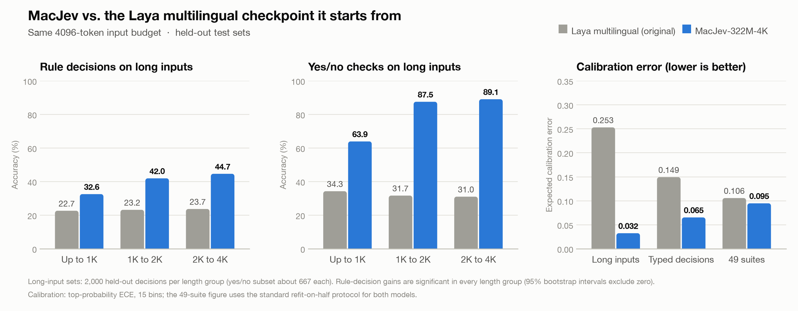

# MacJev-322M-4K-Laya-GGUF

**MacJev on stock llama.cpp: an F16 encoder GGUF, a decision head, and a small runtime. No patched binaries.**

[MacJev-322M-4K-Laya](https://huggingface.co/chaoliangUNSW/MacJev-322M-4K-Laya) is a compact decision model for local Mac agents. You give it an observed state and one typed question with candidate answers. In a single forward pass it returns a probability for every candidate. Use it to rank candidate actions, route tool calls and check task state.

This release follows the route used by community GGUF builds of Laya:

1. The mmBERT/ModernBERT encoder is a standard `modern-bert` GGUF, converted with the unmodified llama.cpp tools.
2. The decision head ships alongside it as `MacJev-322M-4K-Laya-head.safetensors`, in FP32.
3. `macjev_gguf.py` sends token ids to `llama-server`, receives one hidden state per token, and runs the head in NumPy. It needs only `numpy`, `tokenizers` and `safetensors`.



## Highlights

Compared with the Laya multilingual checkpoint it was trained from, with the same 4096-token input budget, on held-out test sets:

| Task | Laya multilingual | MacJev |
|---|---:|---:|
| Yes/no checks on 2K–4K-token inputs | 31.0% | **89.1%** |
| Rule decisions on 2K–4K-token inputs | 23.7% | **44.7%** |
| Rule decisions on long inputs, all lengths | 23.2% | **39.7%** |
| Typed decisions | 35.2% | **42.2%** |
| Calibration error on long inputs, lower is better | 0.253 | **0.032** |

- **Reads long observations.** Yes/no task-state checks on 2K–4K-token inputs rise from 31% to 89% accuracy.
- **Probabilities you can threshold.** Calibration error on long inputs is about 8 times lower, so stated confidence closely tracks actual accuracy.
- **Better on public benchmarks too.** Across 11,600 public decisions from typed decisions, Emotion and AG News, accuracy rises by 1.5 points, with a 95% interval of 1.1 to 1.8.
- **Reproducible.** The long-input and public-benchmark gains appear in all three independently trained seeds. This release is the seed chosen in advance on development data.

## Quickstart

You need llama.cpp's `llama-server` and Python 3.10 or newer. On a Mac, `brew install llama.cpp` provides it. On other systems, use a [llama.cpp release](https://github.com/ggml-org/llama.cpp/releases).

```bash
hf download chaoliangUNSW/MacJev-322M-4K-Laya-GGUF --local-dir MacJev-GGUF
cd MacJev-GGUF
python -m pip install -r requirements.txt
```

Start the encoder server. The encoder reads the whole input at once, so keep these flags:

```bash
llama-server -m MacJev-322M-4K-Laya-F16.gguf --host 127.0.0.1 --port 8080 \
  --embeddings --pooling none -c 4096 -b 4096 -ub 4096 -np 1 -fa on
```

Then, from another terminal in the same folder:

```python
from macjev_gguf import MacJevGGUF

model = MacJevGGUF(".", server_url="http://127.0.0.1:8080")
result = model.decide(
    state={
        "request": "打开浏览器",
        "available_actions": ["open_browser", "copy_file", "ask_user"],
    },
    question={
        "t": "choice",
        "ins": "Which available action best matches the user's request?",
        "crit": {
            "open_browser": "Open the user's browser",
            "copy_file": "Copy a file inside the approved folder",
            "ask_user": "Ask for clarification",
        },
    },
)
print(result["answer"], result["probabilities"])  # A decision only. Nothing is executed.
```

Or let the script start and stop the server for you, with one JSON object per line:

```bash
echo '{"state": {"request": "open the browser"}, "question": {"t": "noul", "ins": "Does the user want a browser opened?"}}' \
  | python macjev_gguf.py --start-server
```

Other question shapes:

```python
score = {"t": "score", "ins": "How complete is the observed task?",
         "crit": ["Not started", "Partly complete", "Complete and verified"]}
boolean = {"t": "noul", "ins": "Does the observation prove that the requested file exists?"}
```

The result contains `answer`, `probabilities`, `top_probability`, `input_tokens`, `latency_ms`, and `actions_executed: False`. Score answers are ordered string indices; Noul answers are `"false"` and `"true"`.

Inputs can use up to 4096 tokens in total and 1024 for the question and options. Anything larger raises `InputBudgetError` instead of being truncated. The runtime tokenizes with the shipped Hugging Face tokenizer and sends token ids directly.

### LM Studio users

LM Studio ships its own `llama-server`, so you may not need to install llama.cpp at all. On a Mac it is inside `~/.lmstudio/extensions/backends/llama.cpp-*/`. The binary from LM Studio's llama.cpp backend 2.41.0 serves this file with the flags above and returns the same hidden states as the Homebrew build. Use it in place of `llama-server` in the command above.

The GGUF file holds the encoder, and the decision head lives in the separate safetensors file, so run MacJev through `macjev_gguf.py`. To let an LM Studio chat model use it, expose `decide()` as a tool or MCP server.

## Validation

- **Same decisions as the FP32 model where it counts.** The GGUF picks the same top answer on every clear-cut decision: 4,964 of 4,964 validation decisions where the FP32 answer leads by at least 0.06.
- **Same accuracy.** Development accuracy is identical to the FP32 model.
- **Exact head.** Given the same encoder states, the NumPy head matches the PyTorch head to within 0.000005 in logits.

Full per-file measurements, conversion details and llama.cpp flags are in `validation.json`. Tested with llama.cpp build b10964 (Homebrew 0.4.1, Metal). On an M1 Max, a full request took about 0.11 s up to 1024 tokens, 0.64 s up to 2048 and 1.7 s up to 4096, including transferring the hidden states over HTTP.

## Files

| File | Purpose |
|---|---|
| `MacJev-322M-4K-Laya-F16.gguf` | Encoder, 629 MB, `general.architecture = modern-bert` |
| `MacJev-322M-4K-Laya-head.safetensors` | Decision head, type embeddings, scorer and auxiliary head in FP32, 60 MB |
| `macjev_gguf.py` | Runtime: `MacJevGGUF` class, CLI, and a helper that starts `llama-server` |
| `macjev_inputs.py` | Tokenization and input layout with strict 4096/1024 budgets |
| `tokenizer/`, `rl_agent_config.json` | Tokenizer and serving configuration |
| `manifest.json` | SHA-256 of every file; the runtime checks the files it loads |
| `validation.json` | Measured agreement with the FP32 model and conversion details |
| `LICENSE`, `NOTICE`, `MMBERT_LICENSE` | License and attribution |

## Other formats

- [PyTorch FP32](https://huggingface.co/chaoliangUNSW/MacJev-322M-4K-Laya), with training details
- [MLX for Apple silicon](https://huggingface.co/chaoliangUNSW/MacJev-322M-4K-Laya-MLX)

## License and attribution

Apache-2.0, inherited from Laya; see `LICENSE` and `NOTICE`. The mmBERT-base backbone is MIT-licensed; see `MMBERT_LICENSE`. The GGUF was produced with unmodified [llama.cpp](https://github.com/ggml-org/llama.cpp) tools. MacJev is an independent project. It is not affiliated with or endorsed by JEV or the Laya authors, and it contains no JEV weights.

- [Laya model](https://huggingface.co/convaiinnovations/laya) and [source](https://github.com/NandhaKishorM/laya)
- [mmBERT-base](https://huggingface.co/jhu-clsp/mmBERT-base)

## Community

Interested in compact decision models, local agents, and practical macOS automation? Join our [Discord community](https://discord.gg/udfvMu2GM).

如果你也对轻量决策模型、本地 Agent 和 macOS 自动化感兴趣，欢迎加入我们的 [Discord 社区](https://discord.gg/udfvMu2GM)。
